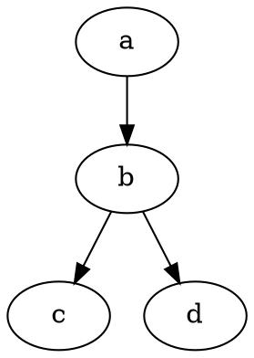

# Draw a graph

Drawing is basic usage of TeX. Perhaps you know
[graphviz](https://graphviz.org/), another drawing languages:

`main.gv`:



```sh
dot -Tpng -omain.png main.gv
```


You don't need to declare the position of node a, b, c and d.
The compiler of graphviz will calculate it:

```sh
dot main.gv
```


TeX has a TikZ library named `graph drawing` to provide same feature.

```tex
\documentclass[tikz]{standalone}
\usetikzlibrary{arrows.meta, graphs, graphdrawing, shapes.geometric}
\usegdlibrary{layered}
\title{graph}
\begin{document}
\begin{tikzpicture}[rounded corners, >=Stealth, auto]
  \graph[layered layout, nodes={draw, align=center}]{%

    a -> b -> {c, d}

  };
\end{tikzpicture}
\end{document}
```

Different from graphviz, you can use powerful TeX syntax in `graph drawing`.
Run `lx build` to see this example:


This example only supports LuaTeX, not pdfTeX and XeTeX.
because `graph drawing` is written in lua, not TeX.
